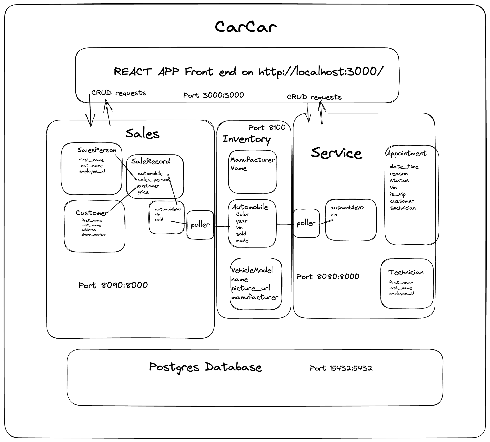

# CarCar

Team:

* Colin Prise - Service
* Luis Bravo - Sales

## Design
CarCar allows users to document sales, services, and current inventory.

Their are several microservices written in React interfacing with a Django backend API. 

The inventory microservice allows for adding manufacturers, car models, and vehicles to inventory.

The service microservice allows for adding technicians, making appointments, viewing made appointments, and showing service history of cars tied to their Vin Numbers.

The sales microservice shows car sales, displays sales records, and manages customers and salespeople.

The poller polls for the Automobile Value Object from the Inventory API every 60 seconds.


## Inventory microservice
Inventory Microservice Models


    Manufacturer:
        name

    VehicleModel:
        name
        picture_url
        manufacturer (Foreign key with Manufacturer)

    Automobile:
        color
        year
        vin
        sold
        model (Foreign key with vehicle model)

## Service microservice

Service Microservice Models


    Technician:
        first_name
        last_name
        employee_id

    AutomobileVO:
        vin
    
    Appointment:
        date_time
        reason
        status
        vin
        is_vip
        customer
        technician(Foreign key with Technician)

If the car was purchased from Inventory then they receive VIP treatment

## Sales microservice

Sales Microservice Models


    AutomobileVO:
        vin
        import_href
    
    SalesPerson:
        first_name
        last_name
        employee_id

    Customer:
        first_name
        last_name
        address
        phone_number

    SaleRecord:
        automobile(Foreign key with AutomobileVO)
        sales_person(Foreign key with SalesPerson)
        customer(Foreign key with Customer)
        price

Sales and SaleRecord pulls vin to record sales.

AutomobileVO is the Value Object being polled with the poller from automobile in inventory.


## How to Run this Project

1. cd into the directory you would like the project to be run from and type git clone https://gitlab.com/ColinPrize/project-beta.git

2. cd into the project directory:
    project_beta

3. Next you will run the following three commands:
    1. docker volume create beta-data
    2. docker-compose build
    3. docker-compose up

4. if you are macOS you will see a warning about an environment variable OS missing. You can safely ignore this

5. To access the API backend you can make HTTP requests using Insomnia.

6. To access the front end you can go to http://localhost:3000/ where the REACT app lives


## Project Diagram
#+html: <p align="center"></p>

## API Documentation

Inventory API

Manufacturers 

List manufacturers	    GET	http://localhost:8100/api/manufacturers/
Response:

```
{
  "manufacturers": [
    {
      "href": "/api/manufacturers/1/",
      "id": 1,
      "name": "Daimler-Chrysler"
    }
  ]
}
```


Update a specific manufacturer	PUT	http://localhost:8100/api/manufacturers/:id/
Create a manufacturer  POST http://localhost:8100/api/manufacturers/
```
{
  "name": "Chrysler"
}

Response:

{
  "href": "/api/manufacturers/1/",
  "id": 1,
  "name": "Chrysler"
}

```

Get a specific manufacturer	GET	http://localhost:8100/api/manufacturers/:id/

Delete a specific manufacturer	DELETE	http://localhost:8100/api/manufacturers/:id/


Vehicle Models


List vehicle models	GET	http://localhost:8100/api/models/

Create a vehicle model	POST	http://localhost:8100/api/models/

```
{
  "name": "Sebring",
  "picture_url": "https://upload.wikimedia.org/wikipedia/commons/thumb/7/71/Chrysler_Sebring_front_20090302.jpg/320px-Chrysler_Sebring_front_20090302.jpg",
  "manufacturer_id": 1
}
```

response:

```
{
  "href": "/api/models/1/",
  "id": 1,
  "name": "Sebring",
  "picture_url": "https://upload.wikimedia.org/wikipedia/commons/thumb/7/71/Chrysler_Sebring_front_20090302.jpg/320px-Chrysler_Sebring_front_20090302.jpg",
  "manufacturer": {
    "href": "/api/manufacturers/1/",
    "id": 1,
    "name": "Daimler-Chrysler"
  }
}
```

Get a specific vehicle model	GET	http://localhost:8100/api/models/:id/

```
{
  "href": "/api/models/1/",
  "id": 1,
  "name": "Sebring",
  "picture_url": "https://upload.wikimedia.org/wikipedia/commons/thumb/7/71/Chrysler_Sebring_front_20090302.jpg/320px-Chrysler_Sebring_front_20090302.jpg",
  "manufacturer": {
    "href": "/api/manufacturers/1/",
    "id": 1,
    "name": "Daimler-Chrysler"
  }
}
```


Update a specific vehicle model	PUT	http://localhost:8100/api/models/:id/

```
{
  "name": "Sebring",
  "picture_url": "https://upload.wikimedia.org/wikipedia/commons/thumb/7/71/Chrysler_Sebring_front_20090302.jpg/320px-Chrysler_Sebring_front_20090302.jpg"
}
```


Delete a specific vehicle model	DELETE	http://localhost:8100/api/models/:id/


Automobile Information

Note: The identifiers for automobiles in this API are not integer ids. They are the Vehicle Identification Number (VIN) for the specific automobile.

List automobiles	            GET	http://localhost:8100/api/automobiles/

```
{
  "autos": [
    {
      "href": "/api/automobiles/1C3CC5FB2AN120174/",
      "id": 1,
      "color": "yellow",
      "year": 2013,
      "vin": "1C3CC5FB2AN120174",
      "model": {
        "href": "/api/models/1/",
        "id": 1,
        "name": "Sebring",
        "picture_url": "https://upload.wikimedia.org/wikipedia/commons/thumb/7/71/Chrysler_Sebring_front_20090302.jpg/320px-Chrysler_Sebring_front_20090302.jpg",
        "manufacturer": {
          "href": "/api/manufacturers/1/",
          "id": 1,
          "name": "Daimler-Chrysler"
        }
      },
      "sold": false
    }
  ]
}
```


Create an automobile	        POST	http://localhost:8100/api/automobiles/

```
{
  "color": "red",
  "year": 2012,
  "vin": "1C3CC5FB2AN120174",
  "model_id": 1
}
```

Response:

```
{
  "href": "/api/automobiles/1C3CC5FB2AN120174/",
  "id": 1,
  "color": "yellow",
  "year": 2013,
  "vin": "1C3CC5FB2AN120174",
  "model": {
    "href": "/api/models/1/",
    "id": 1,
    "name": "Sebring",
    "picture_url": "https://upload.wikimedia.org/wikipedia/commons/thumb/7/71/Chrysler_Sebring_front_20090302.jpg/320px-Chrysler_Sebring_front_20090302.jpg",
    "manufacturer": {
      "href": "/api/manufacturers/1/",
      "id": 1,
      "name": "Daimler-Chrysler"
    }
  },
  "sold": false
}
```


Get a specific automobile	    GET	http://localhost:8100/api/automobiles/:vin/

As noted, when you query an automobile by its VIN. You would use the URL like this example:

http://localhost:8100/api/automobiles/1C3CC5FB2AN120174/


Update a specific automobile	PUT	http://localhost:8100/api/automobiles/:vin/


```
{
  "color": "red",
  "year": 2012,
  "sold": true
}
```


Delete a specific automobile	DELETE	http://localhost:8100/api/automobiles/:vin/


## Service API calls

List technicians	GET	http://localhost:8080/api/technicians/


Response:


```
{
	"technicians": [
		{
			"first_name": "Rick",
			"last_name": "James",
			"employee_id": "444254"
		},
    ]
}
```


Create a technician	POST	http://localhost:8080/api/technicians/
```
{
	"first_name" : "Robert",
	"last_name": "Marley",
	"employee_id": "2246"
}
```

response:

```
{
	"first_name" : "Robert",
	"last_name": "Marley",
	"employee_id": "2246"
}
```


Delete a specific technician	DELETE	http://localhost:8080/api/technicians/:id

List appointments	GET	http://localhost:8080/api/appointments/

```
{
	"appointments": [
		{
			"href": "/api/showappointment/8",
			"date_time": "2006-10-25T14:30:00+00:00",
			"reason": "car crash",
			"status": "BOOKED",
			"vin": "1GNDV23L26D236839",
			"customer": "Samantha",
			"technician": "Rick"
		},
		{
			"href": "/api/showappointment/9",
			"date_time": "2006-10-25T14:30:00+00:00",
			"reason": "car crash",
			"status": "BOOKED",
			"vin": "1GNDV23L26D236839",
			"customer": "Samantha",
			"technician": "Rick"
		},
        ]
}
```


Create an appointment	POST	http://localhost:8080/api/appointments/

```
{
			"date_time": "2024-11-25T14:30:00+00:00",
			"reason": "car crash",
			"status": "BOOKED",
			"vin": "1GNDV23L26D236818",
			"customer": "Prince",
			"technician": "Rick"
}

```

response:

```
{
	"date_time": "2024-11-25T14:30:00+00:00",
	"reason": "car crash",
	"status": "BOOKED",
	"vin": "1GNDV23L26D236818",
	"customer": "Prince",
	"technician": "Rick"
}
```

Delete an appointment	DELETE	http://localhost:8080/api/appointments/:id

Set appointment status to canceled	PUT	http://localhost:8080/api/appointments/:id/cancel

Set appointment status to finished	PUT	http://localhost:8080/api/appointments/:id/finish
